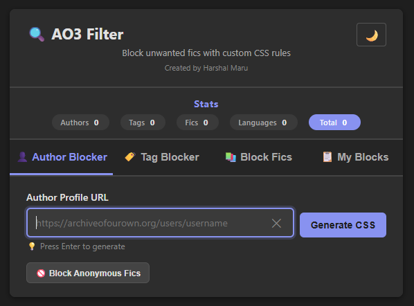
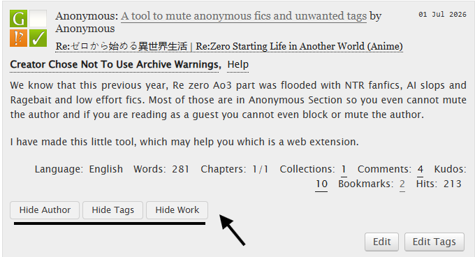
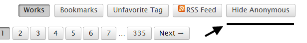

# AO3 Filter

**Block unwanted fanworks on Archive of Our Own with custom CSS.**

AO3 Filter is a browser extension that helps you hide works you don't want to see on AO3 — by author, by tag, by individual fic, or even by language. It generates custom CSS that you can paste directly into your AO3 Site Skin, or let the extension auto‑inject it for you.

---

## Why This Exists

If you've spent any time in the Re:Zero fanfiction community (or any fandom, really), you've probably noticed the flood of:

- Anonymous NTR and Rape fics
- Ragebait and low-effort content
- AI-generated slop

This extension was built because i was tired of it and worst things was you could not even block anonymous fics or when you were reading as a guest.

---

## Features

- **Author Blocker** – Hide all works from a specific author.
- **Tag Blocker** – Fetch tags from any work and select which ones to block.
- **Language Blocker** – Block all works written in a specific language (fetched automatically from the work).
- **Block Fics** – Load all works from an author and selectively hide individual fics.
- **In-Page Blocking Buttons** – Quickly hide authors, tags, or individual works directly from the AO3 search page without opening the popup.
- **Anonymous Blocking Toggle** – Show or hide all anonymous fics with a single click, right from the AO3 navigation bar.
- **Persistent Storage & Auto-Injection** – Blocks are automatically saved and injected on every AO3 visit. No need to manually update Site Skins.
- **Live Stats Bar** – See at a glance how many authors, tags, fics, and languages you've blocked, right at the top of the popup.
- **My Blocks** – View, manage, and remove all your blocked authors, tags, fics, and languages in one place.
- **Import/Export** – Backup your block list as JSON or restore from a previously exported file.
- **Copy & Download** – Copy generated CSS to clipboard or download as a `.css` file (for manual Site Skin use).
- **Search** – Filter through fics with fuzzy search.
- **Dark/Light Mode** – Toggle between dark and light themes to suit your preference.

---

## Installation

### Chrome Web Store

*(Coming soon – link will be added once published)*

### Firefox Add-ons

*(Coming soon – link will be added once published)*

### Manual Installation (Developer Mode)

1. Download or clone this repository.
2. Open Chrome and go to `chrome://extensions/`.
3. Enable **Developer mode** (toggle in the top right).
4. Click **Load unpacked** and select the extension folder.
5. The extension icon will appear in your toolbar.

---

## How to Use

Click the extension icon in your browser toolbar to open the popup. Your blocks are **applied** on every AO3 page you visit.

### In-Page Blocking (No Popup Needed)

On any AO3 search results page, each work blurb now has three buttons:
- **Hide Author** – Block all works by that author instantly.
- **Hide Tags** – Open a popup to select specific tags from that work and block them.
- **Hide Work** – Block that specific work.

All blocks are applied immediately without refreshing the page.

### Anonymous Blocking Toggle

A **"Hide Anonymous"** button appears in the AO3 top navigation bar (next to "Works", "Bookmarks", etc.). Click it to instantly hide all anonymous fics on the current page. Click it again to show them.

This toggle works across all AO3 pages and is remembered even after you close the browser.

### Popup Interface

#### Author Blocker

1. Paste an author's profile URL (e.g., `https://archiveofourown.org/users/username`).
2. Click **Generate CSS** or press `Enter`.
3. Click **➕ Add to Block List** to save the author to your blocks.
4. Works from this author will now be hidden on AO3.

#### Tag Blocker

1. Paste a work URL (e.g., `https://archiveofourown.org/works/12345`).
2. Click **Fetch Tags** or press `Enter`.
3. Select the tags you want to block.
4. Click **➕ Add Selected to Block List**.
5. Works with these tags will now be hidden on AO3.

**New: Language Blocking** – When you fetch tags, the work's language is also detected. Check the "Block Language" checkbox to hide all works in that language.

#### Block Fics

1. Paste an author's profile URL.
2. Click **Load All Fics** or press `Enter`.
3. All works from that author will be loaded, grouped by fandom.
4. Select the individual fics you want to block.
5. Click **➕ Add Selected to Block List**.
6. These fics will now be hidden on AO3.

#### My Blocks

View all your blocked authors, tags, fics, and languages. You can:

- Remove individual items by clicking the ✕ button
- Toggle anonymous fic blocking (same as the in‑page toggle)
- Export your block list as a JSON file
- Import a previously exported block list

---

## Applying the CSS to AO3 (Optional)

**Blocks are now automatically applied** when you visit AO3 via the extension's content script. You no longer need to manually create a Site Skin.

However, if you want to manually apply CSS (for example, to combine with an existing Site Skin or to use the filters on older browsers), you can still copy/download the generated CSS and add it to a Site Skin:

### Step-by-Step Guide (Manual Method)

1. **Log in** to your AO3 account.
2. Go to your **Dashboard** → **Skins**.
3. Click **Create Site Skin** (or edit an existing one).
4. Copy the CSS from the extension (via the **📋 Copy** or **⬇️ Download** buttons).
5. Paste it into the **CSS** box.
6. Click **Submit**.
7. Activate the skin via **Dashboard** → **Skins** → **Use**.

### Important Notes

- Auto-injection works on all logged-in and guest visits to AO3.
- Manual Site Skins are optional and can be used alongside the extension.
- If you disable the extension, blocks will stop being applied.

---

### Having issues?

**Raise a GitHub Issue** – any feedback is valuable and appreciated.

---

## Credits

- **Created by:** Harshal Maru
- **Inspiration:** This extension was born out of frustration with the flood of anonymous NTR, ragebait, and AI slop in the Re:Zero fanfiction community.
- **Shoutout:** A huge thanks to this [fic](https://archiveofourown.org/works/84876111) for giving me the idea to make this.

---

## License

There is no license. Feel free to clone, steal, copy, or do anything with this repo.

It's on the internet, it's free!

---

*Happy filtering!*
